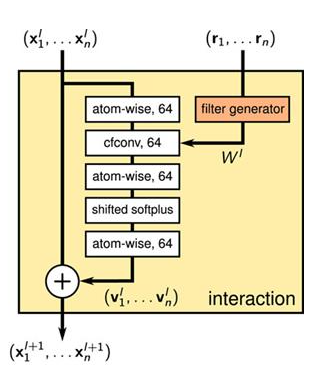
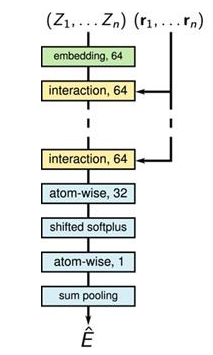
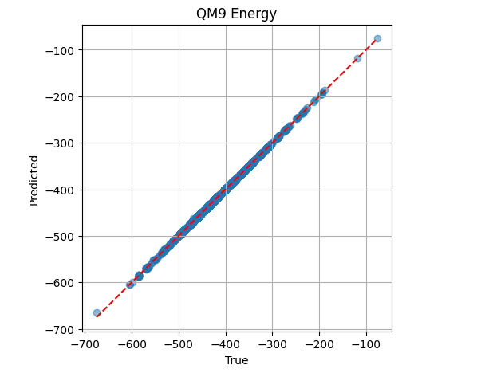
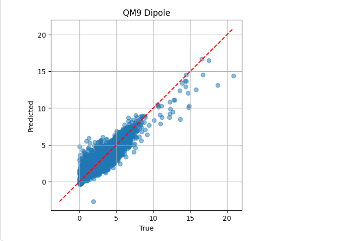
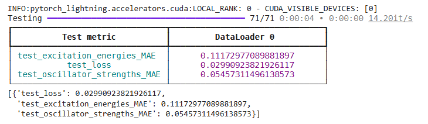
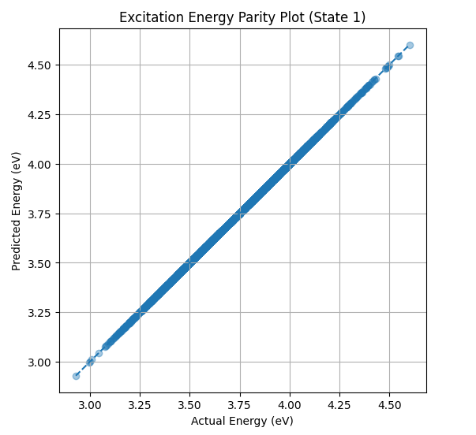
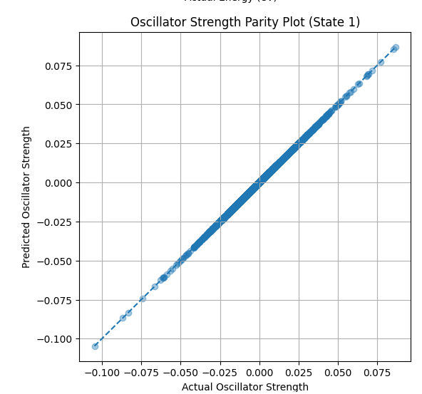
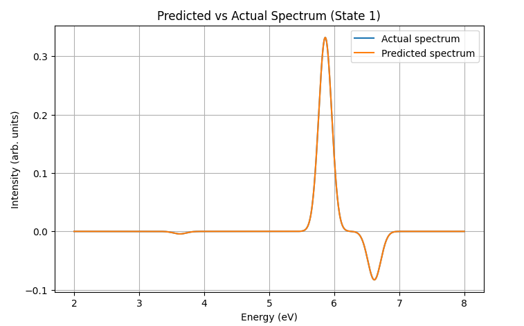

## SchNet for Molecular Property & Excited-State Prediction

## Overview
This project implements a SchNet-based atomistic neural network (ANN) to predict molecular properties using deep learning in Google Colab.

Targets include:
- Internal energy (U0)
- Dipole moment (mu)
- Excitation energies (QeMFi)
- Oscillator strengths

## Methodology
SchNet uses:
- Atomic embeddings
- Continuous-filter convolutions
- Atom-wise aggregation
 

Datasets:
- QM9 (U0, dipole)
- QeMFi (excited states)

## Setup
Download schnet_model.py and run or convert it into a notebook and run on Google Colab. 
It is recommended that the training of the model should be done on GPUs. During training,
it will be better if it is done initially with a smaller number of epochs and then increase it 
gradually

## Results
The metrics for evaluating the model's loss included the MAE and RMSE. Also parity plots were used to compare the actual values (labels) with the predicted ones. 
 

  

## References
Schütt, K.T., Sauceda, H.E., Kindermans, P.J., Tkatchenko, A. and Müller, K.R., 2018. Schnet–a deep learning architecture for molecules and materials. The Journal of chemical physics, 148(24).

Schütt, K., Kindermans, P.J., Sauceda Felix, H.E., Chmiela, S., Tkatchenko, A. and Müller, K.R., 2017. Schnet: A continuous-filter convolutional neural network for modeling quantum interactions. Advances in neural information processing systems, 30.

Pinheiro, G.A., Mucelini, J., Soares, M.D., Prati, R.C., Da Silva, J.L. and Quiles, M.G., 2020. Machine learning prediction of nine molecular properties based on the SMILES representation of the QM9 quantum-chemistry dataset. The Journal of Physical Chemistry A, 124(47), pp.9854-9866.

Vinod, V. and Zaspel, P., 2025. QeMFi: A multifidelity dataset of quantum chemical properties of diverse molecules. Scientific Data, 12(1), p.202.

